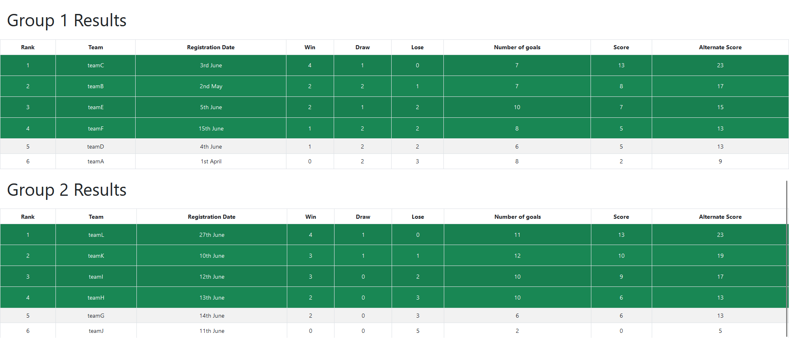

# GovTech GDS ACE : We are the Champions

## Deployment on Heroku
[Link to Keroku App](https://govtech-champion.herokuapp.com/)

## Usage
The main usage of the application is exactly as per specified in the requirements.

1. The user can input a multi-line set of teams to be registered.
2. The user can input a multi-line set of match results between 2 teams.
3. The user can view the team rankings for each group.

**Additional feature:** 
1. The user can input the match results multiple times and this will add on to the existing scores for the teams.
2. There is also validation checks for both the inputs, where invalid dates, group number, match results are catched.
3. If the team mentioned in the match result is not found, an error will also be shown to the user, and all entries in the same instance will not be committed to the database.

**Note:** After submitting the match results, the user may need to click on the refresh data button to view the update rankings.

## Local Setup
If you want to set this up locally, you would need to setup a local database, and fill up the database credentials in the ``CreateConnection.py`` file located in ``backend`` folder.

Then, you can simply run the ``CreateTable.py`` file to auto create the tables required for this application.

Also, before running the frontend, do note to change the proxy value in the ``package.json`` file to ``http://localhost:5000``.

### Commands to run the frontend and backend

1. cd into the frontend folder.
2. run command ``npm install``
3. run command ``npm start``
4. open a new terminal and cd into the project root folder
5. run command ``python -m flask run``

**Note:** You will need to run the frontend and backend service separately on 2 different terminals.

## Results

Here are some snapshot of the results based on the given sample testcases:

### Testcase 1:

### Testcase 2:

### Testcase 3:
